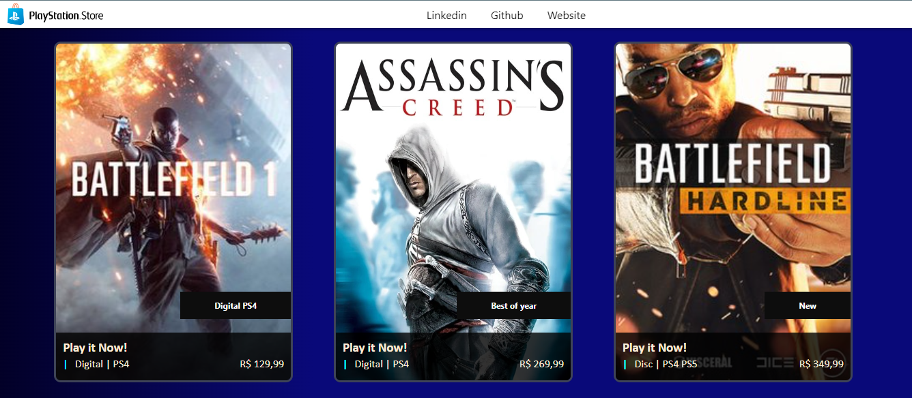
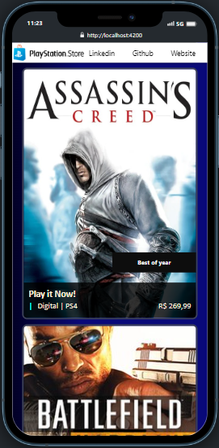

<h1 align="center"> CarModels Blog </h1>

Site clone da PlayStore da Sony.  

  <a href="#-tecnologias">Tecnologias</a>&nbsp;&nbsp;&nbsp;|&nbsp;&nbsp;&nbsp;
  <a href="#-projeto">Projeto</a>&nbsp;&nbsp;&nbsp;|&nbsp;&nbsp;&nbsp;
  <a href="#-layout">Layout</a>&nbsp;&nbsp;&nbsp;|&nbsp;&nbsp;&nbsp;

 

  

## 🚀 Tecnologias

Esse projeto foi desenvolvido com as seguintes tecnologias:

- HTML e CSS
- Typescript
- Git e Github

## 💻 Projeto

Site criado em Angular que possui apenas uma single page application, com uma animação ao colocar o mouse em cima da imagem e troca de cores dos menus. Conteúdo sendo chamado dinamicamente, podendo ser alterados no html principal apenas chamando a função e inserindo os textos e valores.
